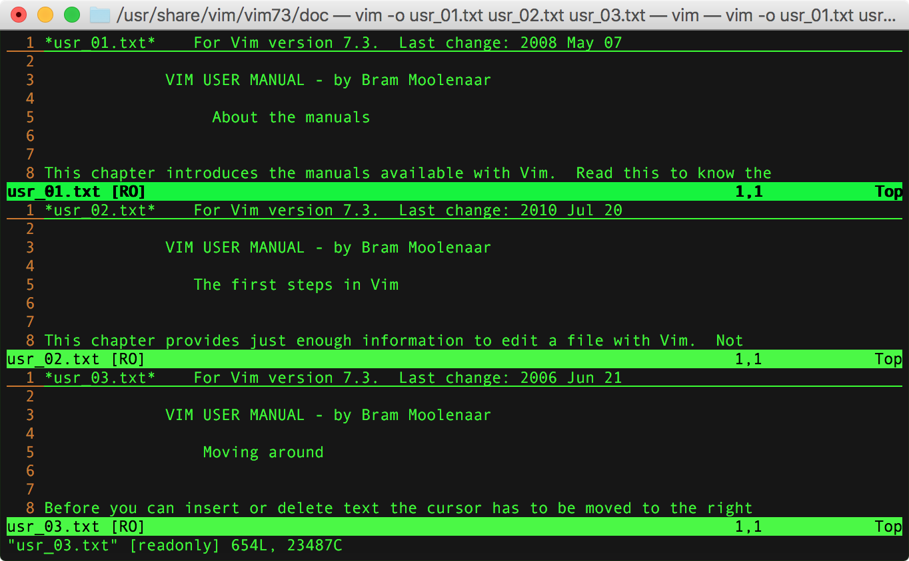
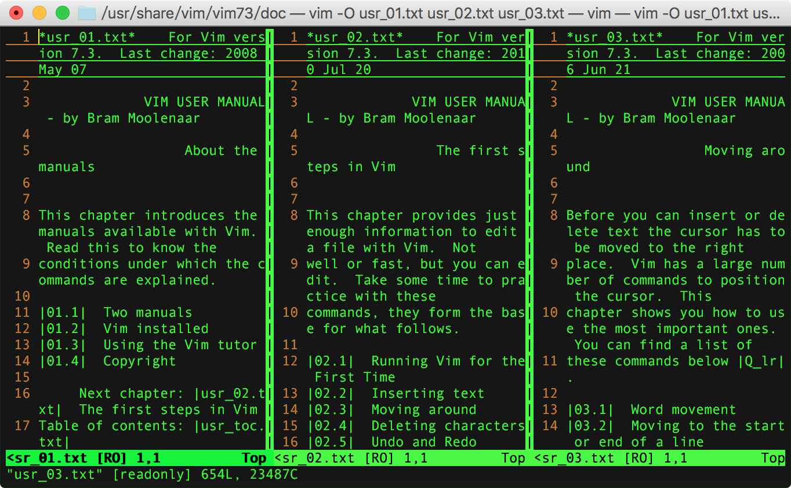
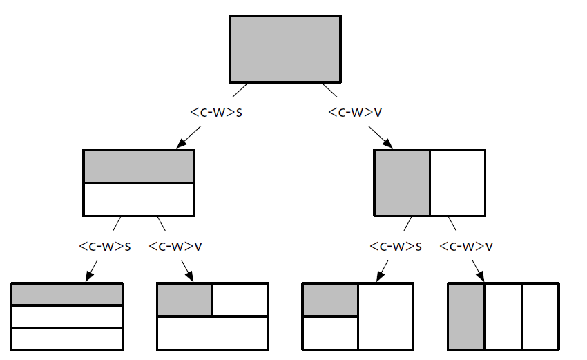
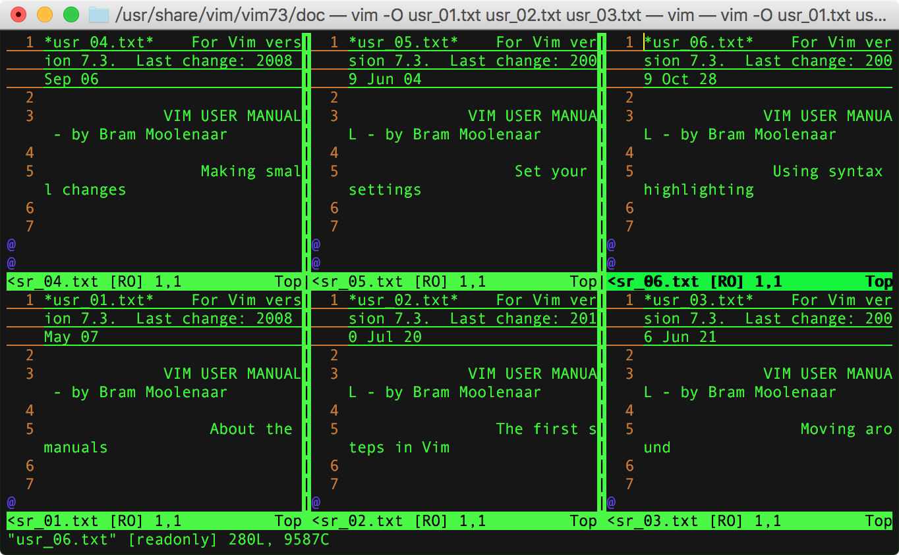
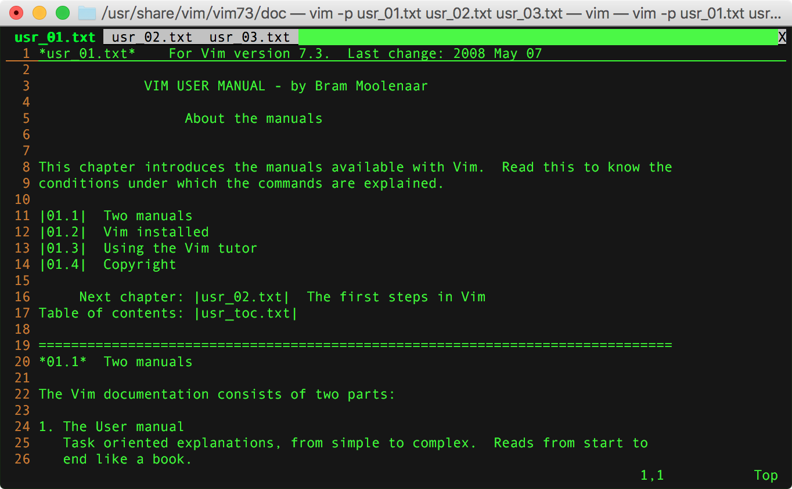

本文梳理了 vim 中复用窗口、分屏窗口和多标签等基本操作。

<!-- more -->

[vim在多个文件之间切换](http://www.cnblogs.com/hnrainll/archive/2011/04/29/2032662.html)  
[vim打开文档和多文档编辑](http://blog.csdn.net/huiguixian/article/details/6231425)

## 查看文件信息

按键             | 说明             | 备注
----------------|------------------|--------
`:f` / `<C-g>`  | 查看当前文件信息   | 包括文件名、属性、行数、阅读进度、光标位置等信息
`1<C-g>`        | 查看当前文件信息   | **绝对路径** 文件名
`:f {filename}` | 拷贝当前文档      | 类似`:w {filename}`

## 复用窗口

复用一个窗口打开编辑多个文档（buffer）。

### open(edit)

当前vim窗口再打开/新建文件

前面我们在调用vim打开文件时，只带了一个文件参数。实际上，在编辑一个文件时，可以通过底行模式指令在当前窗口再打开或新建文件。

命令	             | 作用                 | 备注
-----------------|---------------------|----------------------------
`:e {filename}` / `:open {filename}`   | 当前窗口编辑（edit）文件，如果不存在则新建。<br/>如果当前文件有过修改会提示`No write since last change (add ! to override) `，需先保存或`!`强制覆盖。 | editing.txt
`:n {filename}`                        | **当前窗口新建文件**，如果已存在直接打开。<br/>如果当前文件有过修改会提示`No write since last change (add ! to override) `，需先保存或`!`强制覆盖。      | editing.txt
`:files` / `:buffers` / `:ls`          | 列出目前**缓冲区**中的所有文档。<br/> `+` 表示缓冲区已经被修改过了；<br/> `＃` 代表上一次编辑的文档；<br/> `%` 是当前正在编辑的文档。                    | windows.txt

#### workdir

**相对于活动文件目录打开一个文件**

`:e %:h`: 当前文件（%）完整路径去除文件名（`:h`），即打开所在目录的路径。  
按下 `<C-^>` 切回刚才正在编辑的文档。  

> 也可通过 `:E` & `:Re` 实现同样的效果。

#### path

`path` 选项允许我们指定一些目录，当调用 `:find` 命令时，vim 会在这些目录中进行查找。

> `:find` 命令的作用：`Find {file} in 'path' and then :edit it.`

底行输入执行 `:set path ?`，查看 path 的默认配置如下：

```bash
path=.,/usr/include,,
```

1. `.` 为当前文件所在目录；  
2. `/usr/include` 为系统头文件包含目录；  

多个目录之间以逗号（`,`）分割。

如果工作的工程中包含多级嵌套目录呢？每次打开文件都需要输入完整路径，确认很麻烦。  
此时，可以考虑添加查找路径：

```bash
:set path+=app/**
```

`**` 通配符会匹配 `app/` 目录下的所有子目录。

配置查找目录后，`:find` 命令可在目录中查找匹配的文件并打开。

### switch

vim可以接多个文件名作为参数列表（argument list），同时打开多个文件：

```bash
➜  ~  cd /usr/share/vim/vim[0-9][0-9]/doc
➜  doc  vim usr_01.txt usr_02.txt usr_03.txt
```

打开的这几个文件各自有对应的 swap buffer，但共用当前这一个编辑窗口，需要执行命令切换文件。

**多文档切换**

命令             | 说明         | 备注
----------------|--------------|-------------
`:n`            | 编辑下一个文档 | 针对argument list，可参考editing.txt
`:N`            | 编辑上一个文档 | 针对argument list，可参考editing.txt
`:b {n}`        | 移至第n个文档（buffer）          | n为`:files`/`:buffers`中的序号，可参考 windows.txt
`:bd {n}`       | 关闭（delete）第n个文档（buffer） | n为`:files`/`:buffers`中的序号，可参考 windows.txt
`:bn`           | 编辑下一个文档 | 针对buffers，可参考editing.txt
`:bN` / `:bp`   | 编辑上一个文档 | 针对buffers，可参考editing.txt

**说明：**

> `:n`和`:N`只能针对 argument list 打开的多文件间进行切换，vim打开单文件或后期追加打开/编辑文件的将提示 `There is only one file to edit`。
> 对于多个正在编辑的file buffer，需要逐个 `:w` 保存，或者执行 `:qa`/`:qa!` 关闭全部退出 vim。

## 分屏窗口

参考： `/usr/share/vim/vim[0-9][0-9]/doc/windows.txt`

```bash
➜  ~  vim --help
usage: vim [arguments] [file ..]       edit specified file(s)

Arguments:
   --			Only file names after this
   
   -o[N]		Open N windows (default: one for each file)
   -O[N]		Like -o but split vertically
   
```

以下调用 `vim -o` 同时打开3个文件，水平分屏：
 
```bash
➜  doc  vim -o usr_01.txt usr_02.txt usr_03.txt
```



以下调用 `vim -O` 同时打开3个文件，垂直分屏：

```bash
➜  doc  vim -O usr_01.txt usr_02.txt usr_03.txt
```



### 新建分屏

命令	                       | 作用                          
------------------------------|-------------------------------
`:new`/`:vnew`                      | 在顶端/左侧创建一个新的分屏窗口
`:split`(`:sp`) / `:vsplit`(`:vs`)  | 在顶端/左侧新建分屏将当前文档进行多屏显示
`:sf {filename}`                    | 在新窗口中打开指定文件(必须已存在)
`:close` / `:q`                     | 关闭当前窗口
`:only`                             | 关闭除当前窗口外所有窗口

**说明**：

1. `:new`/`:vnew` 在顶端/左侧新建分屏，默认打开空白文件，也可携带 *file* 参数在新屏打开指定文件。  
2. `:sp`/`:vs` 在顶端/左侧新建分屏，默认针对当前文件进行分屏，也可携带 *file* 参数在新屏打开指定文件。  

```bash
CTRL-W n                                                CTRL-W_n
CTRL-W CTRL_N                                           CTRL-W_CTRL-N
:[N]new [++opt] [+cmd]                                  :new
                Create a new window and start editing an empty file in it.

:[N]new [++opt] [+cmd] {file}
:[N]sp[lit] [++opt] [+cmd] {file}                       :split_f
                Create a new window and start editing file {file} in it.  This
                behaves like a ":split" first, and then an ":e" command.

[N]vne[w] [++opt] [+cmd] [file]                        :vne :vnew
                Like :new, but split vertically.

CTRL-W s                                                CTRL-W_s
CTRL-W S                                                CTRL-W_S
CTRL-W CTRL-S                                           CTRL-W_CTRL-S
:[N]sp[lit] [++opt] [+cmd] [file]                       :sp :split
                Split current window in two.  The result is two viewports on
                the same file.

CTRL-W CTRL-V                                           CTRL-W_CTRL-V
CTRL-W v                                                CTRL-W_v
:[N]vs[plit] [++opt] [+cmd] [file]                      :vs :vsplit
                Like :split, but split vertically.
```

在底行输入 `:h :new` 实际上是在当前文档窗格的顶部新开一个窗格打开帮助文档。

以下为水平分屏 `:sp`（CTRL-W_s）和垂直分屏 `:vs`（CTRL-W_v）的效果演示：



#### position

底行输入 `:h :split` 默认会在当前编辑文档的顶部新开窗格显示帮助。

[How can I make Vim open help in a vertical split?](https://vi.stackexchange.com/questions/4452/how-can-i-make-vim-open-help-in-a-vertical-split)

命令                | 作用                          
-------------------|-------------------------------
`:bo h :bo`        ｜ 在当前窗格下面新建分屏窗格打开帮助
`:vert h :vert`    ｜ 在当前窗格左侧新建分屏窗格打开帮助

```bash
Note that the 'splitbelow' and 'splitright' options influence where a new
window will appear.

                                                :vert :vertical
:vert[ical] {cmd}
                Execute {cmd}.  If it contains a command that splits a window,
                it will be split vertically.
                Doesn't work for :execute and :normal.

:lefta[bove] {cmd}                              :lefta :leftabove
:abo[veleft] {cmd}                              :abo :aboveleft
                Execute {cmd}.  If it contains a command that splits a window,
                it will be opened left (vertical split) or above (horizontal
                split) the current window.  Overrules 'splitbelow' and
                'splitright'.
                Doesn't work for :execute and :normal.

:rightb[elow] {cmd}                             :rightb :rightbelow
:bel[owright] {cmd}                             :bel :belowright
                Execute {cmd}.  If it contains a command that splits a window,
                it will be opened right (vertical split) or below (horizontal
                split) the current window.  Overrules 'splitbelow' and
                'splitright'.
                Doesn't work for :execute and :normal.

                                                :topleft E442
:to[pleft] {cmd}
                Execute {cmd}.  If it contains a command that splits a window,
                it will appear at the top and occupy the full width of the Vim
                window.  When the split is vertical the window appears at the
                far left and occupies the full height of the Vim window.
                Doesn't work for :execute and :normal.

                                                :bo :botright
:bo[tright] {cmd}
                Execute {cmd}.  If it contains a command that splits a window,
                it will appear at the bottom and occupy the full width of the
                Vim window.  When the split is vertical the window appears at
                the far right and occupies the full height of the Vim window.
                Doesn't work for :execute and :normal.
```

### 切换分屏

输入 `:h CTRL-W` 可查看 index.txt 中的 Window commands 列表。  
输入 `:h window-move-cursor` 或 `:h CTRL-W_{arg}` 可查看 windows.txt 中具体的切换窗格按键帮助。  

指令             | 作用
----------------|---------------
`<C-w>h`        | 切换焦点到左面的窗口
`<C-w>j`        | 切换焦点到下面的窗口
`<C-w>k`        | 切换焦点到上面的窗口
`<C-w>l`        | 切换焦点到右面的窗口
`<C-w>w`        | 顺序焦点循环切换窗口(below/right)
`<C-w>W`        | 逆序焦点循环切换窗口(above/left)
`<C-w>t`        | 切换焦点到顶部的窗口
`<C-w>b`        | 切换焦点到底部的窗口
`<C-w>p`        | 切换焦点到前一个窗口
`<C-w>q`        | 关闭当前窗口，相当于 `:q` / `:close`

除了使用 `CTRL-W [count] {arg}` 快捷键，也可以使用底行命令 `:wincmd {arg}` 切换窗格。

> arg 可取 j、k、h、l、w、t、b、p、q。

### 移动窗格

指令                | 作用
-------------------|---------------
`<C-w>H`(CTRL-W_H) | move current window to the far left
`<C-w>J`(CTRL-W_J) | move current window to the very bottom
`<C-w>K`(CTRL-W_K) | move current window to the very top
`<C-w>L`(CTRL-W_L) | move current window to the far right

### 分屏示例

以下基于 `vim -O` 打开3个文件的垂直三列分屏再进行水平分屏：

1. 将光标切换聚焦到第一个窗口 `usr_01.txt` 上，执行 `:sp usr_04.txt` 在上面水平切割出的新窗口打开 `usr_04.txt`。
2. `<C-w>l`切换到 `usr_02.txt` 窗口，执行 `:sp usr_05.txt` 在上面水平切割出的新窗口打开 `usr_05.txt`。
3. `<C-w>l`切换到 `usr_03.txt` 窗口，执行 `:sp usr_06.txt` 在上面水平切割出的新窗口打开 `usr_06.txt`。

最终分割出六宫格布局：



### 尺寸调整

如果窗格过矮，可通过 `:resize +N` 增大 N 个字符高度。  
如果窗格过窄，可通过 `:vertical resize +N` 增大 N 个字符宽度。  

`:h window-resize` 查看相关议题帮助。

命令       | 作用                          
----------|-------------------------------
CTRL-W_=  |  make all windows the same height & width
CTRL-W_+  |  increase current window height N lines
CTRL-W_-  |  decrease current window height N lines
CTRL-W_<  |  decrease current window width N columns
CTRL-W_>  |  increase current window width N columns

```bash
1. Window resizing                                      window-resize

                                                CTRL-W_=
CTRL-W =        Make all windows (almost) equally high and wide, but use
                'winheight' and 'winwidth' for the current window.
                Windows with 'winfixheight' set keep their height and windows
                with 'winfixwidth' set keep their width.

:res[ize] -N                                    :res :resize CTRL-W_-
CTRL-W -        Decrease current window height by N (default 1).
                If used after :vertical: decrease width by N.

:res[ize] +N                                    CTRL-W_+
CTRL-W +        Increase current window height by N (default 1).
                If used after :vertical: increase width by N.

:res[ize] [N]
CTRL-W CTRL-_                                   CTRL-W_CTRL-_ CTRL-W__
CTRL-W _        Set current window height to N (default: highest possible).

:{winnr}res[ize] [+-]N
                Like :resize above, but apply the size to window {winnr}
                instead of the current window.

z{nr}<CR>       Set current window height to {nr}.

                                                CTRL-W_<
CTRL-W <        Decrease current window width by N (default 1).

                                                CTRL-W_>
CTRL-W >        Increase current window width by N (default 1).

:vertical res[ize] [N]                  :vertical-resize CTRL-W_bar
CTRL-W |        Set current window width to N (default: widest possible).
```

> [vim 改变窗口的大小](http://blog.csdn.net/vanwaals/article/details/6457233)  
> [vim窗口调整高度和宽度](http://blog.csdn.net/cbbbc/article/details/44316881)  
> [vim: vs sp 调整窗口高度和宽度](http://www.cnblogs.com/xuechao/archive/2011/03/29/1999292.html)  

## 多标签

> **REFERENCE MANUAL**: `/usr/share/vim/vim[0-9][0-9]/doc/tabpage.txt `
> **topic**: Editing with windows in multiple tab pages.
> **keyword**: *tab-page* *tabpage*

```bash
➜  ~  vim --help
usage: vim [arguments] [file ..]       edit specified file(s)

Arguments:
   --			Only file names after this
   
   -p[N]		Open N tab pages (default: one for each file)
```

以下调用 `vim -p` 同时打开3个文件，分布在同一窗口的3各标签（tab page）：

```bash
➜  ~  cd /usr/share/vim/vim[0-9][0-9]/doc
➜  doc  vim -p usr_01.txt usr_02.txt usr_03.txt
```



### 新建/关闭标签

命令                   | 说明 
----------------------|----------
 `:tabnew`            | Open a new tab page with an empty window
 `:tabe` / `:tabedit` | Open a new tab page with an empty window
 `:tabs`              | List the tab pages and the windows they contain. <br/>- Shows a ">" for the current window; <br/>- Shows a "+" for modified buffers.
 `:tabc` / `:tabclose` | Close current tab page <br/> you can specify the **tab index** that want to close.
 `:tabo` / `:tabonly`  | Close all other tab pages.

#### :tab

`:tab` 完整命令格式：`:[count]tab {cmd}`

> Execute {cmd} and when it opens a new window open a new tab page instead.

一般后续接 cmd，例如 `:tab split` : 新建tab打开当前文档（opens current buffer in new tab page）

> 在 tab 页中搭配使用 `:new`/`:vnew`、`:sp`/`:vs` 可在 tab 页中进行分屏。

在底行输入 `:h :new` 是在当前文档窗格的顶部新开一个窗格打开帮助文档。

也可考虑新建一个专门的标签页用来阅读查看帮助文档。

命令             | 说明
----------------|--------------
`:tab help gt`  | opens tab page with help for "gt"
`:.tab help gt` | as above
`:+tab help`    | opens tab page with help after the next tab page
`:-tab help`    | opens tab page with help before the current one
`:0tab help`    | opens tab page with help before the first one
`:$tab help :tab` | opens tab page with help for `:tab` after the last one

#### :tabnew

`:h :tabnew` 查看新建空白 tab 的命令 `tabnew`：

```bash
:[count]tabe[dit]                               :tabe :tabedit :tabnew
:[count]tabnew
                Open a new tab page with an empty window, after the current
                tab page.  If [count] is given the new tab page appears after
                the tab page [count] otherwise the new tab page will appear
                after the current one.
                    :tabnew     " opens tabpage after the current one
                    :.tabnew    " as above
                    :+tabnew    " opens tabpage after the next tab page
                                " note: it is one further than :tabnew
                    :-tabnew    " opens tabpage before the current one
                    :0tabnew    " opens tabpage before the first one
                    :$tabnew    " opens tabpage after the last one
```

`:tabnew` 命令后面也可指定 *file* 参数，新开tab打开指定文件。

```bash
:[count]tabe[dit] [++opt] [+cmd] {file}
:[count]tabnew [++opt] [+cmd] {file}
                Open a new tab page and edit {file}, like with :edit.
                For [count] see :tabnew above.

:[count]tabf[ind] [++opt] [+cmd] {file}                 :tabf :tabfind
                Open a new tab page and edit {file} in 'path', like with
                :find.  For [count] see :tabnew above.
                {not available when the +file_in_path feature was disabled
                at compile time}
```

#### :tabclose

`:h :tabclose` 查看关闭 tab 的命令 `tabclose`：

```bash
                    :tabclose       " close the current tab page

:{count}tabc[lose][!]
:tabc[lose][!] {count}
                Close tab page {count}.  Fails in the same way as :tabclose
                above.
                    :-tabclose      " close the previous tab page
                    :+tabclose      " close the next tab page
                    :1tabclose      " close the first tab page
                    :$tabclose      " close the last tab page
                    :tabclose -2    " close the two previous tab page
                    :tabclose +     " close the next tab page
                    :tabclose 3     " close the third tab page
                    :tabclose $     " close the last tab page
```

### 切换标签

命令                         | 说明                      | 备注
----------------------------|---------------------------|-------------
`tabfir` / `:tabr`          | Go to the first tab page. | `:tabfirst` / `:tabrewind`
`:tabl`                     | Go to the last tab page.  | `:tablast`
`:tabn` / `:tabnext` / **`gt`** | Go to the next tab page.  |  Wraps around from the last to the first one.<br/>you can specify the **tab index** that want to jump.
`:tabN` / `:tabp` / `:tabprevious` / **`gT`** | Go to the previous tab page. | Wraps around from the first one to the last one.<br/>you can specify the **tab index** that want to jump back.

> `{count}gt`: Go to tab page {count}.

#### :tabnext

`:h :tabnext` 查看切换标签的命令 `tabnext`：

```bash
:tabn[ext]                              :tabn :tabnext gt
<C-PageDown>                            CTRL-<PageDown> <C-PageDown>
gt                                      i_CTRL-<PageDown> i_<C-PageDown>
                Go to the next tab page.  Wraps around from the last to the
                first one.

:{count}tabn[ext]
:tabn[ext] {count}
                Go to tab page {count}.  The first tab page has number one.
                    :-tabnext   " go to the previous tab page
                    :+tabnext   " go to the next tab page
                    :+2tabnext  " go to the two next tab page
                    :1tabnext   " go to the first tab page
                    :$tabnext   " go to the last tab page
                    :tabnext $  " as above
                    :tabnext -  " go to the previous tab page
                    :tabnext -1 " as above
                    :tabnext +  " go to the next tab page
                    :tabnext +1 " as above
```

### 移动标签

`tabmove` 命令移动 tab 位置。

```bash
:tabm[ove] [N]                                          :tabm :tabmove
:[N]tabm[ove]
                Move the current tab page to after tab page N.  Use zero to
                make the current tab page the first one.  N is counted before
                the move, thus if the second tab is the current one,
                :tabmove 1 and :tabmove 2  have no effect.
                Without N the tab page is made the last one.
                    :.tabmove   " do nothing
                    :-tabmove   " move the tab page to the left
                    :+tabmove   " move the tab page to the right
                    :0tabmove   " move the tab page to the beginning of the tab
                                " list
                    :tabmove 0  " as above
                    :tabmove    " move the tab page to the last
                    :$tabmove   " as above
                    :tabmove $  " as above

:tabm[ove] +[N]
:tabm[ove] -[N]
                Move the current tab page N places to the right (with +) or to
                the left (with -).
                    :tabmove -  " move the tab page to the left
                    :tabmove -1 " as above
                    :tabmove +  " move the tab page to the right
                    :tabmove +1 " as above
```
