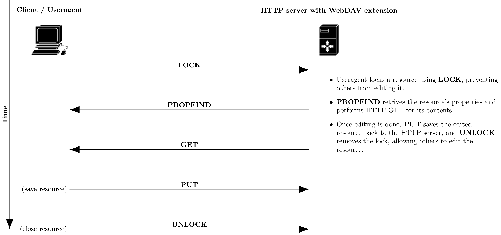

在 macOS 和 linux 上可以通过 mount 命令挂载云盘到本地，也可以使用 curl 命令访问操作 WebDav。

<!-- more -->

## macOS 下使用命令行挂载 WebDAV 云盘

除了在 Finder 中手动连接服务器（Connect to Server），也可考虑改用内置的 mount 系列命令行挂载/卸载 WebDAV：

```Shell title="macOS 下使用 mount_webdav 子命令挂载 webdav"
# 创建本地挂载点目录
$ sudo mkdir /Volumes/webdav
# 修改用户名和用户组为你自己的用户（组）
$ sudo chown -R faner:staff /Volumes/webdav
# 使用 mount_webdav 命令加载 WebDAV，按照提示输入 username:password
$ mount_webdav -i http://mbpa1398.local/webdav/ /Volumes/webdav
# 使用 diskutil umount 命令卸载 WebDAV
$ diskutil umount /Volumes/webdav
```

!!! success

    挂载成功后，执行 `df -h` 命令会输出一条 Filesystem=http://mbpa1398.local/webdav，Mounted on /Volumes/webdav 的条目。

无论哪种方式，挂载成功后，Finder 侧边栏的 Locations/Network 中都会出现相应网盘映射。

## linux 下使用命令行挂载 WebDAV 云盘

在 Ubuntu 或 CentOS 下可以将 WebDAV 挂载为本地磁盘，可采用 [rclone](https://rclone.org/) 云同步命令行工具，或安装 [davfs2](https://savannah.nongnu.org/projects/davfs2) 文件系统扩展。

1. 安装 davfs2：

```Shell
# Ubuntu
$ sudo apt-get install davfs2 -y
# CentOS
$ sudo yum install davfs2 -y
```

2. 创建本地挂载点目录：

```Shell
$ mkdir /mnt/webdav@mbpa1398
```

3. 执行 mount 命令挂载 WebDAV：

```Shell
$ sudo mount -t davfs http://mbpa1398.local/webdav /mnt/webdav@mbpa1398
Please enter the username to authenticate with server
http://mbpa1398.local/webdav or hit enter for none.
  Username: $username
Please enter the password to authenticate user $username with server
http://mbpa1398.local/webdav or hit enter for none.
  Password: $password
```

!!! success

    挂载成功后，执行 `df -h` 命令会输出一条 Filesystem=http://mbpa1398.local/webdav，Mounted on /mnt/webdav@mbpa1398 的条目。

4. 直接编辑 WebDAV 上的文件，然后保存同步：

```Shell
$ sudo vim /mnt/webdav@mbpa1398/test/test.c
```

5. 用完之后，记得解除挂载：

```Shell
$ sudo umount /mnt/webdav@mbpa1398
```

6. 可考虑配置开机自动挂载，涉及以下配置文件：

    - davfs2配置文件：/etc/davfs2/davfs2.conf
    - davfs2密码配置：/etc/davfs2/secrets
    - 自动挂载配置文件：/etc/fstab

## WebDAV collaborative authoring verbs

[RFC 4918 - HTTP Extensions for Web Distributed Authoring and Versioning (WebDAV)](https://datatracker.ietf.org/doc/html/rfc4918) @[RFC Reader](https://www.rfcreader.com/#rfc4918)

WebDAV extends the set of standard HTTP verbs and headers allowed for request methods. The added verbs include:

Verb      | Action
----------|------------------
COPY      | copy a resource from one uniform resource identifier (URI) to another
LOCK      | put a lock on a resource. WebDAV supports both shared and exclusive locks.
MKCOL     | create collections (also known as a directory)
MOVE      | move a resource from one URI to another
PROPFIND  | retrieve properties, stored as XML, from a web resource. It is also overloaded to allow one to retrieve the collection structure (also known as directory hierarchy) of a remote system.
PROPPATCH | change and delete multiple properties on a resource in a single atomic act
UNLOCK    | remove a lock from a resource

WebDAV collaborative authoring in a compatible HTTP server:



## curl 命令行访问操作 WebDAV

**BTW**: 专业命令行工具 rclone，被誉为“云存储的瑞士军刀”，参考 [使用rclone挂载操作WebDav云盘](./rclone-access-webdav.md)。

1. 认证方式可选 `--basic`，`--digest`，不指定相当于 `--anyauth`，让 cURL 自动选择。
2. -u(--user) 后面可只指定用户名 `-u $username`，将提示输入密码；也可连带指定密码 `-u $username:$password`。

### 拉取文件列表

拉取文件列表，也可指定其他目录（以/结尾）：

```Shell
$ curl -i --basic -u $username -X PROPFIND http://mbpa1398.local/webdav/ --upload-file - -H "Depth: 1" <<end
<?xml version="1.0"?>
<a:propfind xmlns:a="DAV:">
<a:prop><a:resourcetype/></a:prop>
</a:propfind>
end
```

可使用 python -m pip 安装 xmltojson 支持将 xml 转换为 json。

!!! note "xmltojson"

    [xmltojson](https://pypi.org/project/xmltojson/)（依赖 [utils](https://pypi.org/project/utils/)）: Python library and cli tool for converting XML to JSON.

还可以安装 jq 命令行工具（macOS: `brew install jq`），将压缩/转义的 json 字符串转换为格式化的 JSON 对象。

!!! note "jq"

    [jq](https://jqlang.github.io/jq/) is a lightweight and flexible command-line JSON processor.

以下命令拉取根目录xml，并依次管传给 xmltojson 和 jq，输出格式化良好的 json：

```Shell
$ curl -i --basic -u $username -X PROPFIND http://mbpa1398.local/webdav/ -H "Depth: 1" | xmltojson --stdin | jq
```

### 新建目录

在根目录 /webdav 下新建文件夹 curltest：

```Shell
$ curl -v -u $username -X MKCOL http://mbpa1398.local/webdav/curltest/
```

### 上传文件

上传文件 test.txt 到目录 /webdav/curltest 下：

```Shell
$ curl -v -u $username -T test.txt http://mbpa1398.local/webdav/curltest/
```

也可在 url 后续接自定义的目标文件名，将 test.txt 上传为 /webdav/curltest/upload.txt：

```Shell
$ curl -v -u $username -T test.txt http://mbpa1398.local/webdav/curltest/upload.txt
```

### 移动文件

不同目录为移动，相同目录相当于重命名：

```Shell
$ curl -v -u $username -X MOVE http://mbpa1398.local/webdav/curltest/test.txt --header 'Destination: http://mbpa1398.local/webdav/curltest/test2.txt'
```

### 复制文件

将 curltest/test2.txt 复制一份为 curltest/test3.txt：

```Shell
$ curl -v -u $username -X COPY http://mbpa1398.local/webdav/curltest/test2.txt --header 'Destination: http://mbpa1398.local/webdav/curltest/test3.txt'
```

### 下载文件

或 > test2.txt，重定向 stdout 到文件（-v 输出到 stderr）：

```Shell
$ curl -v -u $username http://mbpa1398.local/webdav/curltest/test3.txt -o test3.txt
```

### 删除文件(夹)

删除 curltest 目录下的 test3.txt 文件：

```Shell
$ curl -v -u $username -X DELETE http://mbpa1398.local/webdav/curltest/test3.txt
```

## 参考

[WebDAVDevs/awesome-webdav](https://github.com/WebDAVDevs/awesome-webdav)

- [webdav-browser-extension](https://github.com/WebDAVDevs/webdav-browser-extension)
- [File Management - WebDav](https://chromewebstore.google.com/detail/file-management-webdav/famepaffkmmhdefbapbadnniioekdppm)

[WEBDAV WITH CURL](https://code.blogs.iiidefix.net/posts/webdav-with-curl/), [stokito/webdav_curl](https://gist.github.com/stokito/cf82ce965718ce87f36b78f7501d7940)

[学习 WebDav](https://www.cnblogs.com/janbar/p/13804097.html), [curl 测试 webdav](https://www.cnblogs.com/sky-cheng/p/16546837.html)

[如何在Ubuntu或CentOS将WebDAV挂载为本地磁盘](https://shipengliang.com/software-exp/%E5%A6%82%E4%BD%95%E5%9C%A8ubuntu%E6%88%96centos%E5%B0%86webdav%E6%8C%82%E8%BD%BD%E4%B8%BA%E6%9C%AC%E5%9C%B0%E7%A3%81%E7%9B%98.html)
[Linux 挂载 WEBDAV](https://cloud.tencent.com/developer/article/2152260)，[Linux将WebDAV为本地磁盘](https://blog.lincloud.pro/archives/36.html)
