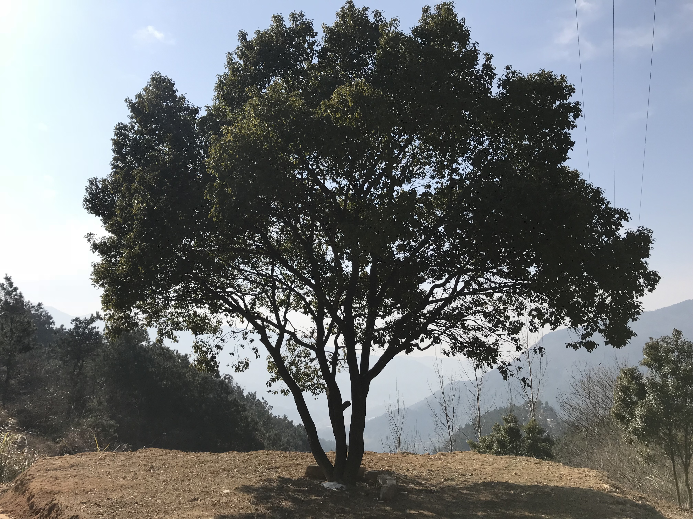
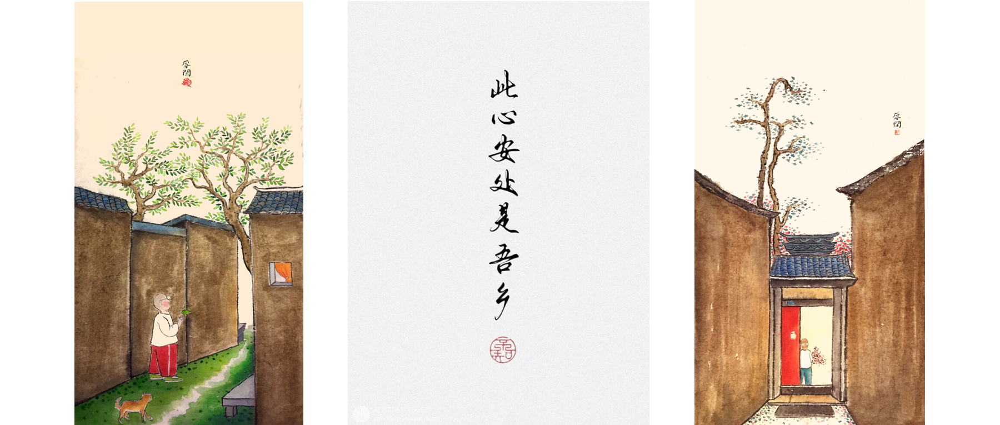

# 在别处或在路上

!!! quote "Elsewhere, or on the road."

    Milan Kundera: Life is like weeds, *life is elsewhere*!

    Jack Kerouac: *On the road*, O ever youthful, O ever weeping.

 

带着最初的激情，追寻着最初的梦想，感受着最初的体验，我们上路吧。
我总是惊讶地发现，我不假思索地上路，因为出发的感觉太好了，世界突然充满了可能性。

在路上，我们永远年轻，永远热泪盈眶。
最好的旅行，是在陌生的地方，发现了一种久违的感动。

“你的此处很美，但你却浑然不知.......然后，继续寻找新的别处，永不满足。”
我们选择了这个方法正如你选择了你的命运，你我的选择都同样是不可改变的。

然而，每一个人都遗憾他不能过其他的生活。
你也会想过一过你所有未实现的可能性，你所有可能的生活。

当生活在别处时，那是梦，是艺术，是诗；
而当别处一旦变为此处，崇高感随即便变为生活的另一面：残酷。

> home | less 1 > *elsewhere* 2 > *homeless*

---

本站总访问量 pv 次，总访客数 uv 次。